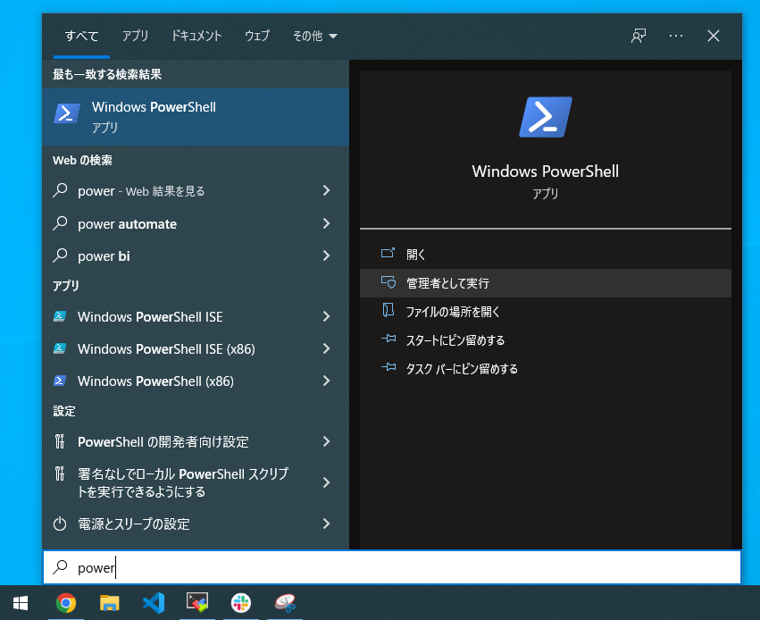

# Windows 開発環境構築

## 初期設定

1. workフォルダ作成

    以下のように、Windowsのホームディレクトリ下に「work」フォルダを作成。

   

2. ライブラリコピー

    dplm_tutorial を workフォルダ内にコピー、フォルダ構成は以下のようになる。

    ```bash
    C:\Users\ユーザ名\work\dplm_tutorial>dir
    2022/04/24  00:44    <DIR>          .
    2022/04/24  00:44    <DIR>          ..
    2022/04/24  00:43    <DIR>          layer
    2022/04/24  00:43    <DIR>          model
    ...
    ```

---

## MobaXterm

MobaXtermとは、sshクライアントであり、リモートPCへのコマンドアクセスやファイルのダウンロード・アップロードが可能である。さらに、X11 ForwardingによりリモートPCの画面を一部表示することが可能である。

1. ダウンロード
    下記から、Home Edition版の「Portable edition」または「Installer edition」をダウンロードする。

    [MobaXtermのダウンロードサイト](https://mobaxterm.mobatek.net/download-home-edition.html)

    - Portable editionは、パソコン本体にインストールせず、実行ファイルだけを使用可能である。
    - Installer editionは、パソコン本体にインストールされる。

2. インストール

    いずれのeditionもMobaXterm_Portable_XXX.zipみたいなファイルがダウンロードされるため、解凍する。

   - Portable editionは、解凍後のフォルダのMobaXterm_Personal_XXX.exeをダブルクリックで起動する。
   - Installer editionは、解凍したインストーラ（XXX.msiファイル）でインストール後に、デスクトップに生成されたMobaXtermのアイコンをダブルクリックで起動する。

    起動が確認出来たら、一旦MobaXtermは閉じる。

---

## WSL

WSL(Windows Subsystem for Linux)とは、Windows上でLinuxを動作させる環境である。
WSLの環境構築は以下5ステップから構成される。

1. WSL機能の有効化

   PowerShell を管理者として実行。

   

   以下のコマンドを実行するだけで、WSLの各種機能のインストールが完了、PCを再起動。

    ```bash
    PS C:\WINDOWS\system32> wsl --install
    ```

2. Ubuntuの設定

    再起動後、自動でUbuntuが起動。Ubuntuの「ユーザ名」と「パスワード」を設定。

   

3. MobaXtermとリンク

    MobaXterm起動後に、先ほどインストールしたWSLが自動的にインポートされている。

    

   左のメニューバーに何も表示されない場合は、左上の「Session」をクリックし、WSLを手動でインポートする。

   

---

## Ubuntu

ここからは、MobaXtermを用いてWSLにリモートアクセスし、環境構築を行う。
なお、MobaXtermを用いる理由として、X11 Forwarding機能により、リモートPC側の画面が表示されるため、開発が何かと便利である。
例えば、matplotlib使ってWSL内で実行した図を表示することが可能である。

1. 更新

    以下コマンドで、Ubuntuをアップデート。パスワードが要求されたら、[2. Ubuntuの設定](#WSL)で設定したパスワードを入力。  

    ```bash
    $ sudo apt update
    $ sudo apt upgrade
    ```

2. パッケージインストール

    以下コマンドで、各種パッケージをインストール

    ```bash
    $ sudo apt install x11-apps python3-tk ffmpeg
    ```

3. X11の動作確認

    X11の動作確認として以下コマンドを実行、目玉のGUIアプリケーション(xeyes)が表示されればOK。すなわち、WSL上のUbuntuで実行したGUI画面がWindows上で表示されたことになる。  

    ```bash
    $ xeyes
    ```

    

4. Windows-WSL間のフォルダパスの作成

    MobaXterm上で以下のコマンドを実行。``ln``コマンドを打つことで、Windows上で設定したworkフォルダがWSLで見れる＆プログラム実行が可能になる。  
    ※ ``ln``コマンドを実行する際は、<span style="color: red;">Windowsのユーザ名</span>を実際の環境に置換すること。

    ```bash
    $ cd
    $ ln -s /mnt/c/Users/Windowsのユーザ名/work/ .
    $ echo export PYTHONPATH="~/work" >> .bashrc
    $ source .bashrc
    ```

5. まとめ

    本セクションで実施した内容は以下の通りである。

    

---

## Python

MobaXtermを用いてWSLへアクセス、Python環境の構築を行う。

1. pip インストール

    ```bash
    $ sudo apt install python3-pip
    $ pip3 install -U pip
    ```

2. 各種pythonライブラリのインストール

    ```bash
    $ pip3 install matplotlib scipy ipdb pillow argparse parse opencv-python torchinfo sklearn
    ```

3. pytorchのインストール

    WSL上のpytorchはGPU利用できないため、[CPU版をインストール](https://pytorch.org/get-started/locally/)。  

    ```bash
    $ pip3 install torch torchvision torchaudio --extra-index-url https://download.pytorch.org/whl/cpu
    ```

4. pytorchの起動確認

    python3を起動後、torchのimportと乱数が表示されるか確認。

    ```bash
    $ python3
    Python 3.6.9 (default, Mar 15 2022, 13:55:28)
    [GCC 8.4.0] on linux
    Type "help", "copyright", "credits" or "license" for more information.
    >>> import torch
    >>> x = torch.rand(5, 3)
    >>> print(x)
    tensor([[0.2114, 0.8774, 0.8149],
            [0.2444, 0.0701, 0.3761],
            [0.9369, 0.4423, 0.5662],
            [0.4302, 0.1465, 0.1882],
            [0.4746, 0.3946, 0.2360]])
    >>>
    ```
