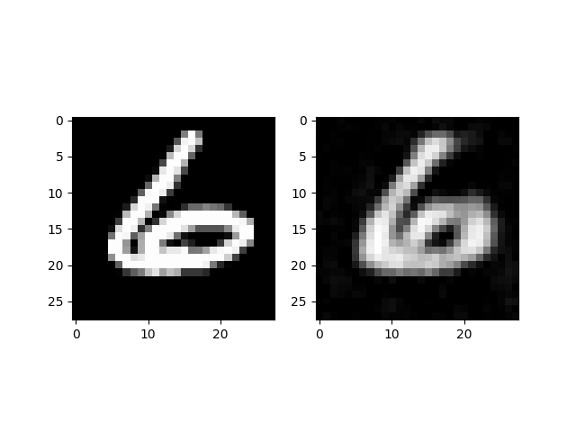

# 課題２：Convolutional Auto-Encoder

MNISTのデータセット(28x28pixelの画像)を使って10次元の画像特徴量を抽出するCAE(Convolutional Auto-Encoder)を``dplm/model/CNNAE.py`` をベースに実装してください。

- CNNAE：Convolutional Auto-Encoderのクラス、``nn.Module`` を継承。
- \__init\___: ニューロン層や活性化関数を定義
- encoder: 入力画像 im から10次元の画像特徴量を抽出し戻り値として返す
- decoder: 画像特徴量 hid から28x28pixelの画像を再構成し、戻り値として返す。
- forward：画像特徴量の抽出から画像再構成までの一連処理を実行。

---

## 事前検討

実装したモデルが期待通りの構成であるかを確認するために、[``torchinfo``](https://github.com/TylerYep/torchinfo)を用いて確認する。
[``torchinfo``](https://github.com/TylerYep/torchinfo)とは、layerの接続順序や、出力のテンソルの形状、パラメータの数を表示してくれるライブラリである。

自作したmodelへ移動し、以下コマンドを実行。各種パラメータが表示され、期待通りの構成であればOK。
```bash
$ dplm/model/
$ pythond CNNAE.py

==========================================================================================
Layer (type:depth-idx)                   Output Shape              Param #
==========================================================================================
CNNAE                                    --                        --
├─Conv2d: 1-1                            [50, 8, 14, 14]           136
├─Conv2d: 1-2                            [50, 16, 7, 7]            2,064
├─Conv2d: 1-3                            [50, 32, 3, 3]            8,224
├─Linear: 1-4                            [50, 100]                 28,900
├─Linear: 1-5                            [50, 10]                  1,010
├─Linear: 1-6                            [50, 100]                 1,100
├─Linear: 1-7                            [50, 288]                 29,088
├─ConvTranspose2d: 1-8                   [50, 16, 7, 7]            8,208
├─ConvTranspose2d: 1-9                   [50, 8, 14, 14]           2,056
├─ConvTranspose2d: 1-10                  [50, 1, 28, 28]           129
==========================================================================================
Total params: 80,915
Trainable params: 80,915
Non-trainable params: 0
Total mult-adds (M): 58.41
==========================================================================================
Input size (MB): 0.16
Forward/backward pass size (MB): 2.51
Params size (MB): 0.32
Estimated Total Size (MB): 2.99
==========================================================================================

```

---

## モデルの有効化
自作したCNNAEが読み込まれるようにするために、``dplm/model/__init__.py``を編集する。init.py の役割は[ここ](https://shimi-dai.com/python-what-is-__init__-py/)を参照。

``` python
from .CNNAE import *        # The CNNAE class is activated by deleting the comment.
#from .BasicRNN import *
```

これにより、以下のように任意のコードからCNNAEクラスを読むことが可能になる。
``` python
from dplm.model import CNNAE
```

---


## 学習

``dplm/test/model/CNNAE_test.py`` の空白部分を埋めて、先ほど自作したCAEを学習する。
学習時は以下のようにフォルダに移動した後にプログラムを実行。

```bash
$ cd ~/work/dplm/test/model/
$ python3 CNNAE_test.py
```

フォルダ（``dplm/test/output``）に以下3つのファイルが保存されていればOK。
- 2_cae_10000.png：入力画像と再構成画像
- 2_model_10000.pth：モデルの重みファイル
- 2_im_feat_10000.npy：画像特徴量 [60000, 10]

画像中左は入力画像、右は再構成画像であり、おおよそ再構成できていることがわかる。




---

## 応用編

今回、学習プログラム ``CNNAE_test.py`` に新たに2つの関数 (get_batch, tensor2numpy) を実装した。
いずれも頻繫に使う関数であるため、``dplm/utils/data.py`` 100行目以降に追加することで、以下のようにどこからでも呼び出せるようにする。

``` python
from dplm.utils import get_batch, tensor2numpy
```
