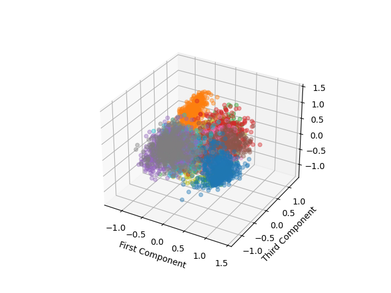

# 課題３：Convolutional Auto-Encoderの内部表現解析

## 実装
課題２で抽出した画像特徴量（``2_im_feat_10000.npy``）を用いて、 ``dplm/test/model/CNNAE_feature_analysis.py`` をベースに可視化解析を行う。
抽出した10次元の画像特徴量 [60000, 10] を可視化解析するために、画像特徴量の次元圧縮をしたものを可視化する。
ここでは次元圧縮手法にPCA(Principal Component Analysis:主成分分析)とt-SNE(t-distributed Stochastic Neighbor Embedding)の2つの解析手法を用いる。PCAは線形圧縮手法、t-SNEは非線形圧縮手法であり、前者はデータ全体の大まかな傾向を、後者はローカルな情報（クラスタなど）を可視化するのに向いている。他にもUMAP(Uniform Manifold Approximation and Projection)や、[Intrinsic Dimension Estimation](https://scikit-dimension.readthedocs.io/en/latest/index.html)などがあるため、データの特性に応じて試してみるとよい。

---

## 実行結果

可視化プログラムが適切に動作すれば、以下のような図が ``dplm/test/output/`` フォルダに保存される。
図中の各点の色は、入力画像の数字ごとに色付けをした。

### PCA

画像特徴量が数字ごとに自己組織化していることがわかる。

### t-SNE

画像特徴量からローカルな特徴を抽出・可視化するため、数字ごとにクラスタリングされている。

