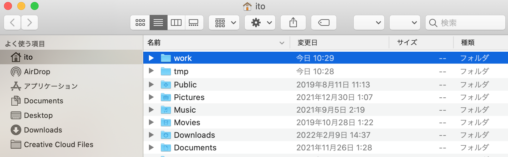
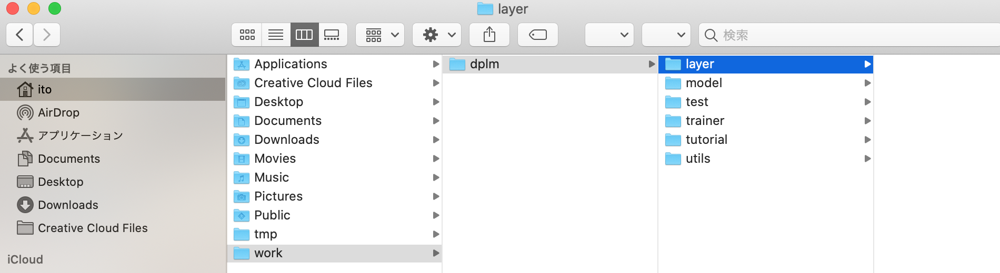
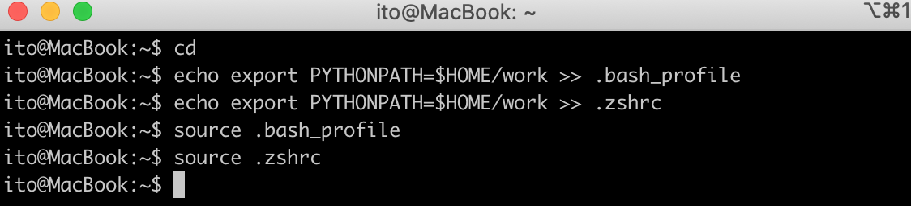

# Mac 開発環境構築

## 初期設定

1. workフォルダ作成

    以下のように、Macのホームディレクトリ下に「work」フォルダを作成。

   

2. ライブラリのコピー

    dplm_tutorial を workフォルダ内にコピー、フォルダ構成は以下のようになる。

   

3. ライブラリパスの設定

    自作ライブラリをpython上のどこからでも実行できるように、PYTHONPATHを設定。
    Mac OS Catalina　以降はデフォルトターミナルが zsh(%) になったため、ここでは念のため zsh(%) と bash($)の両方を設定。
    Mac の``ターミナル``ソフトを起動し、以下のコマンドを実行。なお、Macは基本的にUbuntuと同じコマンドが使える。

    ```bash
    $ cd
    $ echo export PYTHONPATH=$HOME/work >> .bash_profile
    $ echo export PYTHONPATH=$HOME/work >> .zshrc
    $ source .bashrc
    $ source .zshrc
    ```

    

---

## Python

以降、基本的には``ターミナル''アプリを使って操作を実施。
Mac標準のターミナルが使いにくい、カスタイマイズしたい場合は [iTerm2](https://iterm2.com/) をお勧めします。

1. pip インストール
    
    pythonパッケージインストーラであるpipをインストール。

    ```bash
    $ curl https://bootstrap.pypa.io/get-pip.py -o get-pip.py
    $ python3 get-pip.py
    $ pip3 install -U pip
    ```

2. 各種pythonライブラリのインストール

    ```bash
    $ pip3 install matplotlib scipy ipdb pillow argparse parse opencv-python torchinfo sklearn
    ```

3. pytorchのインストール

    Mac上のpytorchはGPU利用できないため、[CPU版をインストール](https://pytorch.org/get-started/locally/)。  

    ```bash
    $ pip3 install torch torchvision torchaudio
    ```

4. pytorchの起動確認

    python3を起動後、torchのimportと乱数が表示されるか確認。

    ```bash
    $ python3
    Python 3.9.7 (default, Oct 13 2021, 06:44:56)
    [Clang 12.0.0 (clang-1200.0.32.29)] on darwin
    Type "help", "copyright", "credits" or "license" for more information.
    >>> import torch
    >>> x = torch.rand(5, 3)
    >>> print(x)
    tensor([[0.2114, 0.8774, 0.8149],
            [0.2444, 0.0701, 0.3761],
            [0.9369, 0.4423, 0.5662],
            [0.4302, 0.1465, 0.1882],
            [0.4746, 0.3946, 0.2360]])
    >>>
    ```
